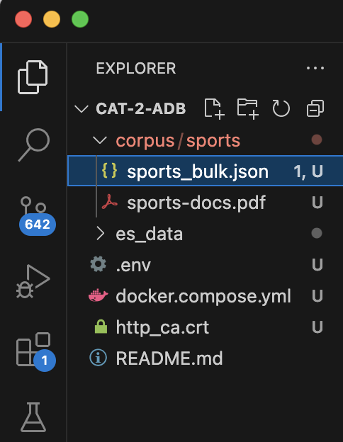

# Information Retrieval System using Elasticsearch & Kibana: A case study of Sports-related documents

## Overview

This technical manual details how to set up a traditional Information Retrieval (IR) system using Elasticsearch and Kibana via Docker Compose. The document corpus consists of sports-related documents.

---

## 🧰 Tools & Technologies

- **Elasticsearch 8.12.0**: Full-text search and analytics engine.
- **Kibana 8.12.0**: Data visualization for Elasticsearch.
- **Docker & Docker Compose**: Containerization and orchestration.
- **Corpus**: Sports-related PDF documents stored in a volume.

---

## 🛠️ Prerequisites

- Docker installed: https://docs.docker.com/get-docker/
- Docker Compose installed: https://docs.docker.com/compose/install/
- Docker Compose yaml file
- Folder structure: 


## Step 1: Setup a Single-node cluster 


### Step 1a: Run Elastic-Search in docker (Single-node Cluster)


#### Create a new docker network.


```
docker network create elastic
```
#### Pull the elastic docker image

```
docker pull docker.elastic.co/elasticsearch/elasticsearch:8.17.4
```

#### Optional: Install Cosign for your environment. Then use Cosign to verify the Elasticsearch image’s signature.
```
wget https://artifacts.elastic.co/cosign.pub
cosign verify --key cosign.pub docker.elastic.co/elasticsearch/elasticsearch:8.17.4
```
if/incase ```wget``` gives an error use ```curl```
#### Start an Elasticsearch container:
```
docker run --name es01 --net elastic -p 9200:9200 -it -m 1GB docker.elastic.co/elasticsearch/elasticsearch:8.17.4
```
The command prints the elastic user password and an enrollment token for Kibana.

#### Make a REST API call to Elasticsearch to ensure the Elasticsearch container is running
```
curl --cacert http_ca.crt -u elastic:$ELASTIC_PASSWORD https://localhost:9200
```

### Step 1b: Run Kibana in docker


#### Pull the Kibana Docker image.
```
docker pull docker.elastic.co/kibana/kibana:8.17.4
```
#### Optional: Verify the Kibana image’s signature.
```
wget https://artifacts.elastic.co/cosign.pub
cosign verify --key cosign.pub docker.elastic.co/kibana/kibana:8.17.4
```
if/incase ```wget``` gives an error use ```curl```

#### Start a Kibana container:
```
docker run --name kib01 --net elastic -p 5601:5601 docker.elastic.co/kibana/kibana:8.17.4
```
The command prints the elastic user password and an enrollment token for Kibana.

#### Lets remove containers now that we have tested elasticsearch and kibana
To remove container run:
```
# Remove the Elastic network
docker network rm elastic

# Remove Elasticsearch containers
docker rm es01
docker rm es02

# Remove the Kibana container
docker rm kib01
```

## Step 2: Setup Multi-node cluster

### Create a ```docker-compose.yml``` and add the following 
```

services:
  elasticsearch:
    image: docker.elastic.co/elasticsearch/elasticsearch:8.12.0
    container_name: elasticsearch
    environment:
      - discovery.type=single-node
      - xpack.security.enabled=false
      - "ES_JAVA_OPTS=-Xms1g -Xmx1g"
    volumes:
      - ./es_data:/usr/share/elasticsearch/data
      - ./corpus:/usr/share/elasticsearch/corpus
    ports:
      - "9200:9200"
    networks:
      - elastic

  kibana:
    image: docker.elastic.co/kibana/kibana:8.12.0
    container_name: kibana
    ports:
      - "5601:5601"
    depends_on:
      - elasticsearch
    networks:
      - elastic

networks:
  elastic:
    driver: bridge
```

Note: Port for Elasticsearch is set to ```9200``` as shown and for Kibana as ```5601``` which will be used as access point to perform operations.

### Add ```.env``` file
This comes is really important in hiding your elastic and kibana password, Elastic stack version and the Port to expose Elasticsearch HTTP API to the host
```
# Password for the 'elastic' user (at least 6 characters)
ELASTIC_PASSWORD=changeme

# Password for the 'kibana_system' user (at least 6 characters)
KIBANA_PASSWORD=changeme

...
# Version of Elastic products
STACK_VERSION=8.17.4
...
# Port to expose Elasticsearch HTTP API to the host
#ES_PORT=9200
ES_PORT=127.0.0.1:9200
...

```

### Run/Compose up to start the cluster
Simply right click on the ```docker-compose.yml``` and select ```compose - select services``` and choose both ```elastic-search``` and ```kibana```

the output on the terminal will be:
```
 *  Executing task: docker compose -f 'docker.compose.yml' up -d --build 'elasticsearch' 'kibana' 

[+] Running 2/0
 ✔ Container elasticsearch  Running                                                          0.0s 
 ✔ Container kibana         Running                                                          0.0s 
 *  Terminal will be reused by tasks, press any key to close it.
```

## Step 3: Document Corpus
The choice of topic was around Sports-related PDF documents stored in a volume.


